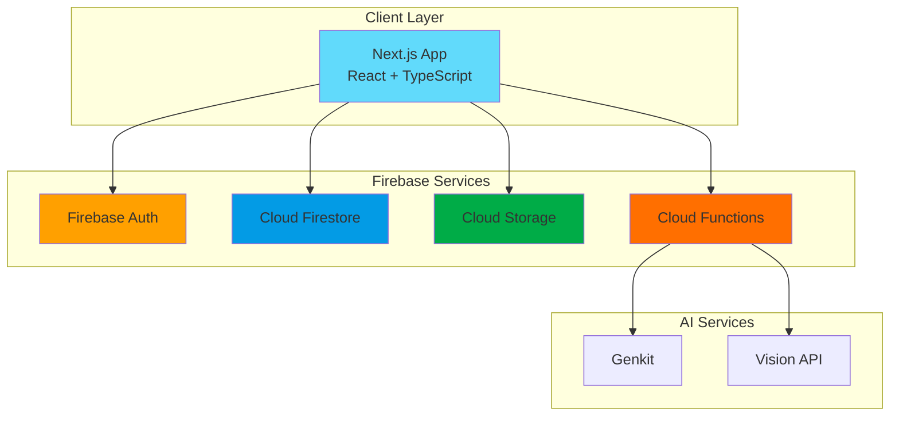

# システムアーキテクチャ

## 概要

FaceRosterは、モダンなWebテクノロジーとクラウドサービスを活用した、スケーラブルなアーキテクチャを採用しています。

## 技術スタック

### フロントエンド
- **フレームワーク**: Next.js 14 (App Router)
- **UIライブラリ**: React 18
- **型システム**: TypeScript 5
- **UIコンポーネント**: Radix UI + ShadCN UI
- **スタイリング**: Tailwind CSS
- **状態管理**: React Context API

### バックエンド & インフラ
- **データベース**: Cloud Firestore
  - NoSQLドキュメントデータベース
  - リアルタイム同期機能
  - 柔軟なクエリ機能
- **認証**: Firebase Authentication
  - メール/パスワード認証
  - Google OAuth
  - セッション管理
- **ストレージ**: Cloud Storage for Firebase
  - 画像ファイルの保存
  - CDN配信
- **ホスティング**: Firebase Hosting / Vercel

### AI機能（将来実装予定）
- **AIフレームワーク**: Google Genkit
- **顔認識**: TensorFlow.js / Cloud Vision API
- **自然言語処理**: Vertex AI

## システム構成図

## アーキテクチャの特徴

### 1. サーバーレスアーキテクチャ
- 自動スケーリング
- 使用量ベースの課金
- 運用負荷の軽減

### 2. リアルタイム同期
- Firestoreのリアルタイムリスナー
- 複数デバイス間での即座のデータ反映
- オフライン対応

### 3. セキュアな設計
- Firebase Security Rules
- 行レベルのアクセス制御
- 暗号化された通信

### 4. 拡張性
- マイクロサービス的なアプローチ
- Cloud Functionsによる処理の分離
- 疎結合な設計

## データフロー

1. **画像アップロード**
   - Client → Cloud Storage → Cloud Functions → Firestore

2. **データ取得**
   - Client ← Firestore (リアルタイムリスナー)

3. **認証フロー**
   - Client → Firebase Auth → Firestore (ユーザーデータ)

## パフォーマンス最適化

### フロントエンド
- Next.js Turbopackによる高速ビルド
- 画像の最適化（next/image）
- コード分割とレイジーローディング

### バックエンド
- Firestoreの複合インデックス
- キャッシング戦略
- バッチ処理の活用

## 監視とロギング

- Firebase Performance Monitoring
- Google Cloud Logging
- エラートラッキング（Sentry検討中） 