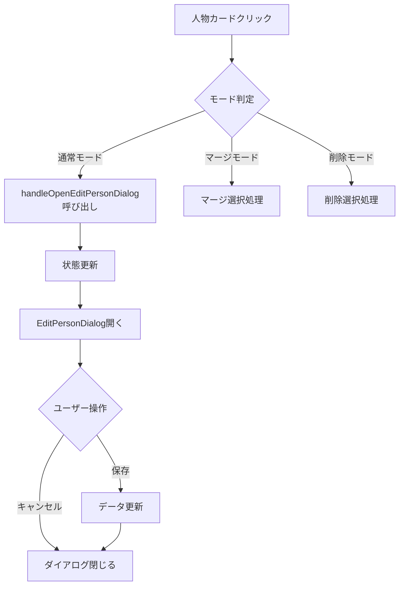

# FaceRoster 関係性作成機能 UXデザイン仕様書

## 概要

FaceRosterアプリケーションにおける人物間の関係性（コネクション）作成機能のUXを、より直感的で柔軟なものに改善するための設計仕様書です。双方向の関係（友人、同僚）と単方向の関係（親子、上司部下）の両方を、明確かつ使いやすい形で扱えるようにします。

## 現状の課題分析

（初期のドラッグ&ドロップ方式に関する課題。現在は改善済み）
- ~~関係の方向性が暗黙的~~
- ~~関係タイプの区別が困難~~
- モバイルでの操作性：ドラッグ&ドロップがタッチデバイスで困難（コンテキストメニューで一部対応検討）
- ~~既存関係の可視性~~ (人物カードへのバッジ表示で一部対応)

## ダイアログ実装ガイドライン

### 1. Radix UIダイアログの基本原則

#### 1.1 開閉制御
- **推奨**: ダイアログコンポーネントは常にレンダリングし、`open`プロパティで開閉を制御
- **非推奨**: 条件付きレンダリング（`{isOpen && <Dialog />}`）

```typescript
// ✅ 推奨
<EditPersonDialog
  isOpen={isEditDialogOpen}
  onOpenChange={setIsEditDialogOpen}
  // ...他のプロパティ
/>

// ❌ 非推奨
{isEditDialogOpen && personToEdit && (
  <EditPersonDialog />
)}
```

#### 1.2 複数ダイアログの管理
- 親ダイアログと子ダイアログが同時に開く場合の制御
- z-indexの階層管理（CSS仕様書参照）

```css
/* ダイアログのz-index階層 */
[role="dialog"][data-state="open"] { z-index: 50; }      /* メインダイアログ */
[role="alertdialog"][data-state="open"] { z-index: 60; } /* 確認ダイアログ */
[data-radix-popper-content-wrapper] { z-index: 70; }     /* ポップオーバー */
```

### 2. イベントフローの定義

#### 2.1 人物編集フロー


#### 2.2 エラー処理フロー
- ダイアログ内でエラーが発生した場合、ダイアログは開いたまま保持
- エラーメッセージはトーストで表示
- 重要な操作（削除など）は確認ダイアログを表示

### 3. 状態管理のベストプラクティス

#### 3.1 ダイアログ状態の一元管理
```typescript
// 親コンポーネントでの状態管理
const [dialogStates, setDialogStates] = useState({
  editPerson: { isOpen: false, data: null },
  createConnection: { isOpen: false, data: null },
  mergePeople: { isOpen: false, data: null },
  deleteConfirm: { isOpen: false, data: null }
});
```

#### 3.2 子ダイアログの状態管理
- 子ダイアログの状態は親ダイアログ内で管理
- 親ダイアログが閉じる際の制御

```typescript
const handleMainDialogOpenChange = (openState: boolean) => {
  // 子ダイアログが開いている場合は親を閉じない
  if (!openState && (isChildDialog1Open || isChildDialog2Open)) {
    return;
  }
  onOpenChange(openState);
};
```

#### 3.3 非同期操作中の状態管理
- 保存中、削除中などの処理中状態を管理
- 処理中はダイアログを閉じない、UIを無効化

## 提案する新しいUXデザイン

### 1. ハイブリッド接続方式

ドラッグ&ドロップを基本としつつ、関係性の性質に応じた視覚的フィードバックを提供します。

#### ドラッグ中の視覚的ガイド

```
【ドラッグ開始時】
- ドラッグ元のカードが軽くハイライト (実装済み: opacity, scale)
- (高度) ドラッグ元のカードから矢印が伸びる (未実装)
- (高度) 矢印の先端がマウスカーソルを追従 (未実装)


【ホバー時】
- ドロップ可能なカードが緑色にハイライト (実装済み: ring, border, bg-color)
- (高度) 関係性のプレビューが表示される (例：「田中太郎 → 山田花子」) (未実装)
- (高度) 既存の関係がある場合は警告アイコン表示 (未実装)
```

### 2. スマートな関係性提案システム（関係性作成ダイアログの改善）

ドロップ時のダイアログを、関係性のタイプに応じて知的に提案します。
（現在の実装は `connection-dialog-improvements.md` の提案を優先しています）

#### 関係性作成ダイアログ（改善版 - `connection-dialog-improvements.md` に基づく）

```
┌─────────────────────────────────────────────┐
│  関係性を作成                               │
│                                             │
│  👤 ソース人物名  ──→  👤 ターゲット人物名   │
│  (あなたが定義する関係: ソースからターゲットへ) │
│                                             │
│ ─────────────────────────────────────────── │
│                                             │
│ 📌 関係性カテゴリ                           │
│                                             │
│  ┌─ Common (青系背景/枠) ───────────────┐   │
│  │ 🏢 Colleague  👥 Friend             │   │
│  │ 🤝 Acquaintance 🎯 Club Member      │   │
│  └─────────────────────────────────────┘   │
│                                             │
│  ┌─ Hierarchical (オレンジ系背景/枠) ────┐   │
│  │ (ソースからターゲットへの役割)           │
│  │ 👨‍👦 Parent   👶 Child                 │   │
│  │ 👔 Manager  📋 Reports to            │   │
│  │ 🎓 Mentor   📚 Mentee                │   │
│  └─────────────────────────────────────┘   │
│                                             │
│  ┌─ Special (ピンク系背景/枠) ───────────┐   │
│  │ 💏 Spouse   💕 Partner              │   │
│  │ 👨‍👩‍👧 Family Member (other)          │   │
│  └─────────────────────────────────────┘   │
│  * 相互排他的な関係は自動的に調整されます。  │
│                                             │
│ ─────────────────────────────────────────── │
│                                             │
│ 🏷️ カスタム関係                            │
│ ┌─────────────────────────────────────┐   │
│ │ その他の関係を入力 (カンマ区切り)...  │   │
│ └─────────────────────────────────────┘   │
│                                             │
│ 📝 詳細情報（任意）                         │
│ ┌─────────────────────────────────────┐   │
│ │ 関係の理由： (改行またはカンマ区切り) │   │
│ │ 例：2020年のプロジェクトで知り合った│   │
│ └─────────────────────────────────────┘   │
│                                             │
│ 💪 関係の強さ：[●●●○○] 3/5 (スライダー)    │
│                                             │
│ ┌─────────────────────────────────────┐   │
│ │ メモ：                              │   │
│ │                                     │   │
│ └─────────────────────────────────────┘   │
│                                             │
│         [キャンセル]  [保存]                │
└─────────────────────────────────────────────┘
```
*   **論理的整合性チェック**: 相互に排他的な関係タイプ（例：親子、上司部下）が選択された場合、他方を自動的に解除するロジックを導入。（実装済み）

### 3. 関係性の可視化改善

#### 人物カードのデザイン改善

人物カードに既存の関係性を示すバッジを表示します。（実装済み - カテゴリ別カウント表示）

```
┌─────────────────────┐
│   👤 田中太郎       │
│                     │
│   🏢 Acme Corp      │
│   🎂 1985/03/15     │
│                     │
│ ┌───┬───┬───┬───┐ │
│ │👥2│👨‍👩‍👧‍👦1│👔1│💑1│ │  <- アイコンは更新されたものを使用
│ └───┴───┴───┴───┘ │
└─────────────────────┘

バッジの意味（例）：
👥 (Users) - 一般的な関係が2つ
👨‍👩‍👧‍👦 (Home/Users2) - 家族関係が1つ
👔 (Award/ClipboardUser) - 職務上の階層関係が1つ
💑 (Heart/Gem) - 特別なパートナー関係が1つ
```

#### ホバー時の関係性プレビュー (未実装)

カードにホバーすると、その人物の関係性を簡潔に表示：

```
┌─────────────────────────┐
│ 田中太郎の関係性        │
├─────────────────────────┤
│ 👥 山田花子（同僚）     │
│ 👥 佐藤次郎（友人）     │
│ 👨‍👦 田中小太郎（息子）   │
│ 👔 鈴木部長（上司）     │
│ 💑 田中良子（配偶者）   │
│                         │
│ [すべて表示...]         │
└─────────────────────────┘
```

### 4. コンテキストメニューによる代替操作 (未実装)

モバイルデバイスやアクセシビリティを考慮した操作方法を提供します。

#### 長押し/右クリックメニュー

```
┌──────────────────────┐
│ 田中太郎             │
├──────────────────────┤
│ ⚡ クイック接続      │
│ 🔗 関係を作成        │
│ 👁️ 関係を表示        │
│ ✏️ 情報を編集        │
│ 🗑️ 削除             │
└──────────────────────┘
```

#### クイック接続モード

```
【Step 1: 対象を選択】
"クイック接続"選択後、接続したい人物をタップ

【Step 2: 関係タイプを選択】
ポップアップから関係タイプを選択して完了
```

### 5. 関係性作成の新フロー

#### フロー1: ドラッグ&ドロップ（デスクトップ向け） (実装済み)

1. **ドラッグ開始**：視覚的フィードバック表示
2. **ドロップ**：関係性作成ダイアログ表示
3. **関係選択**：タイプ別に整理された選択肢から選択
4. **詳細入力**：必要に応じて詳細情報を入力
5. **保存**：Firestoreに保存

#### フロー2: タップ操作（モバイル向け） (未実装)

1. **選択モード起動**：「関係を作成」ボタンをタップ
2. **2人を選択**：関係を作りたい2人をタップで選択
3. **関係選択**：簡易ダイアログから関係タイプを選択
4. **完了**：即座に保存（詳細は後から編集可能）

### 6. 視覚的な関係性マップビュー (未実装)

人物一覧に加えて、関係性を俯瞰できるネットワークビューを提供します。

#### ネットワークビューの特徴

```
【表示モード切り替え】
┌─────┬─────┬─────┐
│ 📋  │ 🕸️  │ 🌳  │
│一覧 │ﾈｯﾄ │階層 │
└─────┴─────┴─────┘

【ネットワークビュー例】
        👤 自分
       /   |   \
    👥    👔    👨‍👩‍👧‍👦
   同僚  上司   家族
    |     |      |
   田中  鈴木   妻・子

【フィルター機能】
□ 友人関係
□ 仕事関係
□ 家族関係
□ その他
```

### 7. スマートな重複防止とエラーハンドリング (一部未実装)

#### 既存関係の検出と処理 (未実装 - 現在は単純に追加)

```
┌─────────────────────────────────────┐
│ ⚠️ 既存の関係があります             │
│                                     │
│ 現在の関係：                        │
│ • 田中太郎 → 山田花子（上司）       │
│                                     │
│ どうしますか？                      │
│                                     │
│ ○ 新しい関係を追加する             │
│   （複数の関係を持つことができます）│
│                                     │
│ ○ 既存の関係を更新する             │
│   （現在の関係を置き換えます）      │
│                                     │
│ ○ キャンセル                       │
│                                     │
│        [戻る]  [続ける]             │
└─────────────────────────────────────┘
```

#### 循環関係の警告 (未実装)

```
┌─────────────────────────────────────┐
│ ⚠️ 循環関係の可能性                 │
│                                     │
│ 山田さんは既に田中さんの上司です。  │
│ 田中さんを山田さんの上司に設定する  │
│ と、循環関係が発生します。          │
│                                     │
│ □ それでも続ける                   │
│                                     │
│        [キャンセル]  [OK]           │
└─────────────────────────────────────┘
```

#### 人物マージ時のコネクション処理 (新規追加・実装済み)

人物A (ソース) を人物B (ターゲット) にマージする場合、以下のようにコネクションが処理されます。
*   人物Aが持っていた全てのコネクションは、人物Bに引き継がれます。
    *   例: A - X の関係は B - X になります。
    *   `connections` ドキュメント内の `fromPersonId` または `toPersonId` が人物AのIDだった場合、人物BのIDに書き換えられます。
*   人物Aと人物Bの間に直接的なコネクションが存在した場合（例: A - B）、そのコネクションはマージ処理中に削除されます。これにより、マージ後の人物Bが自身に対してコネクションを持つ（B - B）ことを防ぎます。
*   コネクションの重複: マージの結果、人物Bが同じ相手と同じタイプのコネクションを複数持つ可能性があります（例：A-Xが「友人」、B-Xも「友人」だった場合、マージ後にB-X「友人」が2つ存在する）。現時点では、これらの重複は許容され、別々のコネクションドキュメントとして保持されます。将来的に重複排除機能を検討できます。

---

### 8. 既存コネクションの表示と管理 (Displaying and Managing Existing Connections)

人物一覧ページ (`/people`) において、個々の人物カード（写真を含む）をクリックすると、その人物の詳細情報を表示・編集するための `EditPersonDialog.tsx` が開きます。このダイアログ内で、以下のコネクション表示・管理機能も提供されます。

#### 8.1. 表示場所の初期案: 人物編集ダイアログ内 (実装済み)

選択された人物の既存コネクションは、その人物の詳細を編集するダイアログ (`EditPersonDialog.tsx`) 内に表示されます。これにより、ユーザーは人物情報を確認・編集する流れで、その人物の人間関係も把握できます。

#### 8.2. 各コネクションで表示する情報 (実装済み)

`EditPersonDialog` 内のコネクションリストでは、各コネクションについて以下の情報を表示します。

*   **接続先の人物名:**
    *   小さなアバター画像または汎用アイコンと共に表示します。
*   **関係の種類 (Types):**
    *   カンマ区切りで表示します。
*   **関係の方向性:**
    *   編集中の人物 (P) と接続先の人物 (C) に対して、関係性が P → C なのか、C → P なのかを分かりやすく表現します。
*   **理由 (Reasons):**
    *   設定されていれば、簡潔に表示します。
*   **メモ (Notes):**
    *   設定されていれば、アイコンなどで存在を示し、クリック/ホバーで表示します。
*   **強さ (Strength):**
    *   設定されていれば表示します。

#### 8.3. `EditPersonDialog` 内のレイアウト (実装済み)

*   人物の基本情報編集フォームの隣（3カラムレイアウトの場合）または下に、新しいセクションとして「関連する人々 (Connections)」を表示します。
*   このセクションは、コネクション数が多くなる可能性を考慮し、スクロール可能にします。
*   各コネクションは、コンパクトなリストアイテムまたは小さなカードとして表示し、上記の情報を整理して提示します。

#### 8.4. 管理アクション (一部実装済み)

各コネクションアイテムの横には、以下のようなアクションボタン/アイコンを配置します。

*   **編集ボタン:** (実装済み) `FileEdit` アイコンのボタン。クリックすると、`CreateConnectionDialog` をそのコネクションの既存データでプリフィルして開きます。ダイアログのタイトルは「コネクションを編集」となり、既存の値（タイプ、理由、強さ、メモ）がフォームにセットされます。保存時には既存のコネクションが更新されます。
*   **削除ボタン:** (実装済み) `Trash2` アイコンのボタン。クリックすると、`AlertDialog` が表示され、ユーザーに「本当にこのコネクション（例：[Aさん]と[Bさん]の[同僚]関係）を削除しますか？この操作は元に戻せません。」といった確認を求めます。確認後、コネクションを削除します。

#### 8.5. 必要なデータ (実装済み)

この機能を実現するためには、`EditPersonDialog` が以下のデータにアクセスできる必要があります（主にコンテキスト経由）。

*   `allUserConnections`: ユーザーの全てのコネクション情報。
*   `allUserPeople`: 全ての人物情報（接続先の人物名を取得するため）。
*   現在編集中の人物のID。

#### 8.6 表示用メイン写真の選択 (Selecting Main Display Photo) (実装済み)

`EditPersonDialog` 内で、人物が複数の `FaceAppearance`（＝複数のRosterや元画像に登場している顔）を持つ場合に、どれをその人物の代表的な表示写真（例: `PeopleList` のカード、各種アバター表示など）として使用するかを選択できるようにします。

*   **UI要素:**
    *   `EditPersonDialog` 内に、その人物の全ての `FaceAppearance` から得られる顔写真のサムネイルをリストまたはグリッド形式で表示します。
    *   各サムネイルには、それがどのRoster（元画像）からのものかを示す簡潔な情報を付与します。
    *   ユーザーは、これらのサムネイルの中から一つを選択できます。選択された写真には、視覚的なインジケーター（例: 青い枠線、チェックマークアイコン）が表示されます。
*   **データ保存:**
    *   選択された写真の `FaceAppearance.faceImageStoragePath` が、`Person` ドキュメントのフィールド `primaryFaceAppearancePath` に保存されます。
*   **表示ロジック:**
    *   アプリケーション全体で人物の代表写真を表示する際（例: `PeopleListItem`）、まず `primaryFaceAppearancePath` を確認します。
    *   設定されていればそのパスの画像を使用し、設定されていなければ `faceAppearances` 配列の最初の要素の画像を使用するなどのフォールバックロジックを適用します。
*   **初期状態:**
    *   `primaryFaceAppearancePath` が未設定の場合、最初の `FaceAppearance` がデフォルトで選択されているかのように表示します。

---

### 9. 実装の優先順位

#### Phase 1: 基本機能の改善（完了済み - `connection-dialog-improvements.md` に基づく）
- 関係タイプの分類とデータモデル更新 (`connections`コレクション)
- 改善されたダイアログUIの実装（カテゴリ別選択、アイコン、カスタム入力、詳細情報入力）
- 基本的な視覚フィードバック（ドラッグ元・ドロップ先のハイライト）
- 論理的整合性チェック（相互排他関係の自動解除）

#### Phase 2: 視覚的改善と基本管理（一部完了済み）
- 人物カードへのバッジ表示（実装済み）
- ドラッグ&ドロップの視覚的フィードバック（実装済み）
- ホバー時の関係性プレビュー（未実装）
- **既存コネクションの表示 (人物編集ダイアログ内) (実装済み)**
- **既存コネクションの削除 (人物編集ダイアログ内 - 確認ダイアログを含む) (実装済み)**
- **既存コネクションの編集 (人物編集ダイアログ内 - `CreateConnectionDialog` を再利用) (実装済み)**

#### Phase 3: モバイル対応（未実装）
- タップベースの関係作成フロー
- コンテキストメニューの実装
- レスポンシブデザインの調整

#### Phase 4: 高度な機能（一部実装済み）
- ネットワークビューの実装（未実装）
- 高度なフィルタリング機能（未実装）
- 関係性の分析機能（未実装）
- 既存関係の検出・更新UI（未実装）
- **人物マージプロセスの強化:** マージダイアログ (`MergePeopleDialog`) にて、マージ後の人物プロファイルに使用するメイン写真を選択できる機能を追加。(実装済み)
- **表示用メイン写真の選択機能の実装:** `EditPersonDialog`にて、人物のメイン表示写真を選択・設定できる機能。(実装済み - Section 8.6 参照)

### 10. 技術的考慮事項

#### パフォーマンス
- 大量の関係性データを扱う際の最適化
- 遅延読み込みとページネーション
- キャッシング戦略

#### アクセシビリティ
- キーボード操作のサポート
- スクリーンリーダー対応
- 高コントラストモード

#### 国際化
- 関係タイプの多言語対応
- 文化的な違いへの配慮（家族構成など）

### 11. まとめ

この新しいUXデザインにより、FaceRosterは複雑な人間関係を直感的かつ正確に記録できるツールとなります。ドラッグ&ドロップの使いやすさを保ちながら、関係の方向性や種類を明確に表現でき、モバイルデバイスでも快適に使用できるようになることを目指します。
（`connection-dialog-improvements.md` の提案を取り込み、より洗練されたダイアログUIが実現されました。）
既存コネクションの表示・編集・削除機能が追加されることで、人物情報の全体像がより把握しやすくなります。
写真選択機能の追加により、ユーザーは人物の代表的な外見をより細かく制御できるようになります。

```
